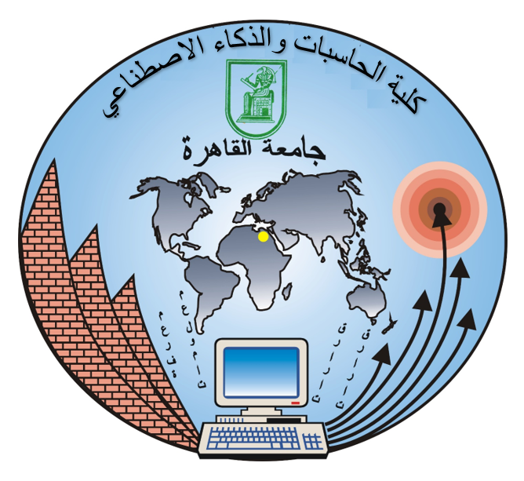
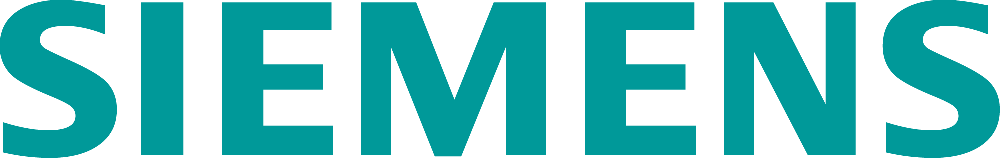
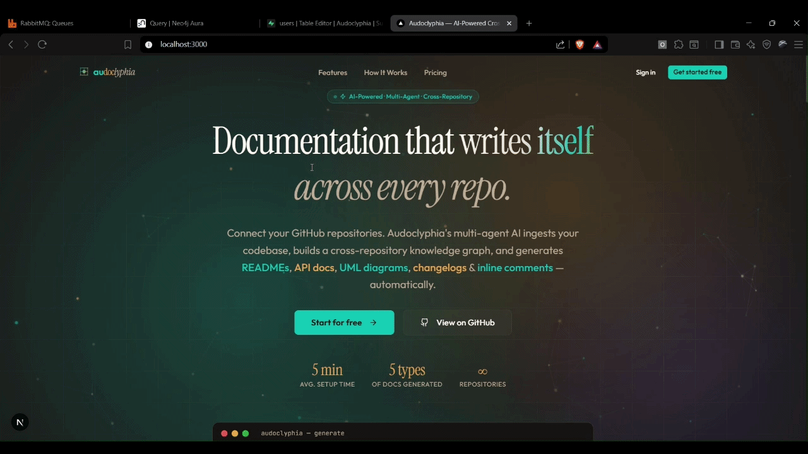
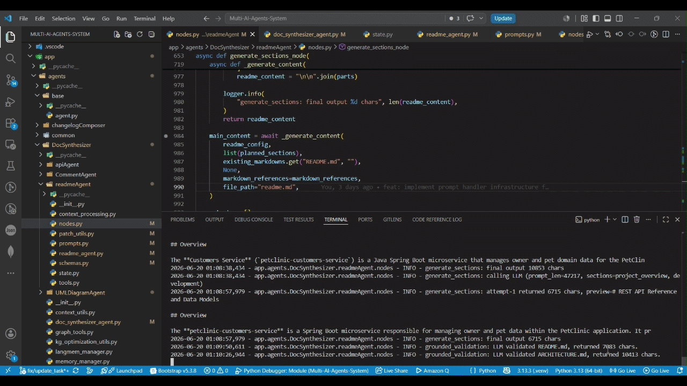
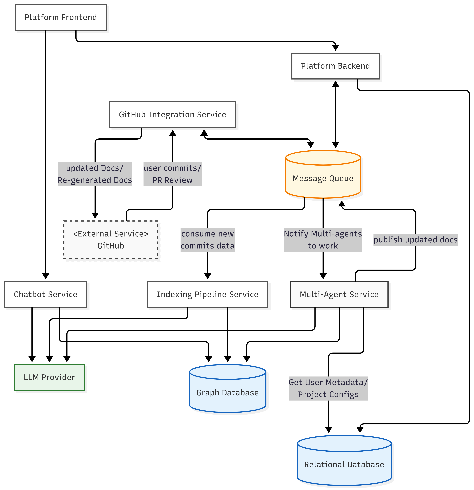
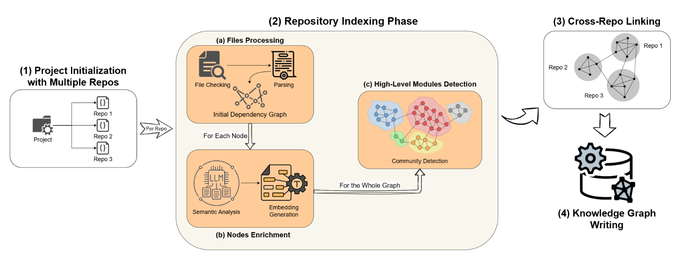
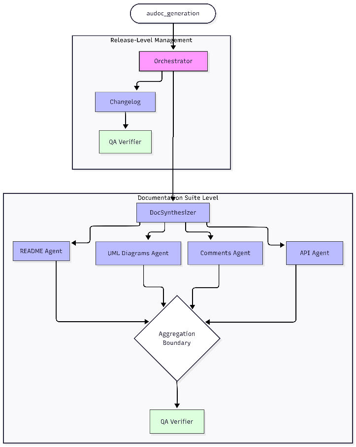

## 📑 AI-Powered Automation for Software Documentation 📑

# 🏌🏻‍♂️ Who we are
Audoclyphia is our Final Graduation Project from the **Faculty of Computing and Artificial Intelligence, Cairo University**, under the supervision of *Dr. Mohammad El-Ramly*.
The project was conducted under the technical guidance and industry support of the **Siemens Digital Industries Software** Sponsorship Program, reflecting advanced practices in AI-assisted engineering, automation, and intelligent system optimization. Our Siemens supervisors were *Eng. Mahmoud Ibrahim* and *Eng. Omar Hesham*.

&nbsp;&nbsp;&nbsp;&nbsp;

&nbsp;&nbsp;&nbsp;&nbsp;

&nbsp;&nbsp;&nbsp;&nbsp;

# 🎓 Abstract

Synchronizing documentation with rapidly evolving codebases remains a persistent engineering bottleneck: as code changes without corresponding updates, **documentation debt accumulates**, and project context becomes stale. The Stack Overflow 2024 Developer Survey finds that over *60% of developers spend 30+ minutes daily searching for answers*, with fewer than half finding accurate information internally; the Atlassian State of Developer Experience 2025 independently reports that *50% lose 10+ hours weekly to poor information access*. Existing frameworks address this only within single-repository contexts and lack continuous synchronization with code evolution. 

We introduce **Audoclyphia**, an AI-powered multi-agent platform automating documentation generation and maintenance for single and multi-repository projects. Audoclyphia constructs a Neo4j knowledge graph, agnostic to language and framework, representing codebases and cross-repository dependencies, employing a LangGraph/LangMem orchestrator to coordinate specialized agents that produce and verify **READMEs, UML diagrams, API specifications, code comments, and CHANGELOGs**. Treating documentation as a living asset, Audoclyphia updates the graph on each commit and auto-commits artifacts via pull requests, leveraging PR reviews as human-in-the-loop feedback to persist team preferences in long-term memory. 

# 📊 Evaluation

**73.8%** overall score across 13 real-world repositories (Python, Java, JavaScript, C++) — **+5.01 points** over the CodeWiki baseline (68.79%).

| Evaluation Track | Score | Measures |
|---|---|---|
| Deterministic (rule-based) | 0.76 | Structural correctness, hallucination checks |
| AI-judged (LLM-as-a-judge) | 0.72 | Clarity, completeness, usefulness |
| Operational health (CLEAR) | 0.73 | Cost, Latency, Efficacy, Assurance, Reliability |

**Human preference:** In a blind A/B study (20 evaluators × 3 projects, 60 head-to-head votes), Audoclyphia was preferred **63%** of the time over leading agentic coding assistants, with an average quality rating of **4.15 / 5** vs **3.88 / 5**.

# 🪸 Demo

### GitHub Installation and Multi-Repository Project Initialization Workflow

### Initialization Results

# 🏛️ System Architecture
Audoclyphia is built as an **event-driven microservices architecture**, with two principal services—**the Indexing Pipeline Service** and **the Multi-Agent Service**—wired together with a **GitHub Integration Service** and **RabbitMQ** for asynchronous communication and **Protobuf** (Google’s Protocol buffers) for inter-service data serialization (60% to 80% reduction in payload size, which drives an 80% improvement in response time compared to JSON). Storage is split across **PostgreSQL** (user/project metadata) and **Neo4j** (the cross-repository knowledge graph).

# 🕸️ Repositories
| Repo | Role | Tech Stack |
| -- | -- | -- |
| GitHub Integration Service | The Service that has the GitHub app facing webhook recieving all user's repos events (e.g., Push, PR events), prepare the user repo data, merge PR commits for consequent processing through RabbitMQ and recieves docs results and updates the user's repo with a dedicated PR | Node.js, Express, Octokit (github integration) | 
| Indexing Pipeline Service | The data ingestion and indexing layer, the first phase of transforming the user's codebase into an intelligent language-agnostic multi-repository knowledge graph by parsing files and extracting all kinds of entities and relationships, with also embedding for semantic search retrieval and generating semantic summary for each node and cluster for intelligent context retrieval | AST Tree-Sitter, nomic-embed-text-v1.5 embedding model, Sentence Transformer, Community Detection (Leiden Algorithm) | 
| Multi-Agent Service | Orchestrates multiple specialized AI agents to generate and maintain user’s project documents utilizing the underlying knowledge graphs as the context and source of truth for generation. | LangGraph, LangMem, Mermaid.js, Xiaomi Mimo-v2.5 (Generation Model), DeepSeek v3.2 (Judge Model) |
| Chatbot Service | The service exposing a REST API for interacting with the project information embedded in the knowledge graph using Graph Retrieval Augmented Generation (GraphRAG). | LangGraph, MCP (Model Context Protocol) server, Redis |
| Platform Frontend + Backend | The user exposed platform that manages the user’s dashboard, creation of project, repositories documentation configuration and project team members management along with viewing the projects documentation and interacting with the project chatbot.  | Backend (Node.js, Express.js), Frontend (Next.ts, Shadcn/UI, tailwind CSS, Tanstack, Zustand) |

# 🧩 Indexing Pipeline Workflow

# 🕹️ Multi-Agent Service Architecture

---

> Full documentation and expanded setup guides coming soon.